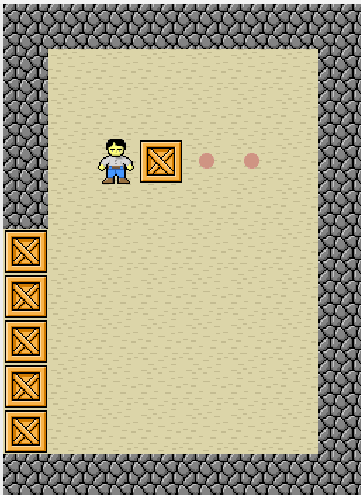

# Sokobon

Authors: Ali Abedrabbo, Abd Alrahman Atieh, and  Abdulfattah Morad
## Abstract
This report describes the difficult logic-based warehouse puzzle game Sokobon's development process. A group of students developed a trustworthy and entertaining gaming experience using the Model View Controller (MVC) design pattern. Manipulating containers to specific goal locations within the warehouse is the game's purpose.
The project's goals, which were to provide a playable and dependable Sokobon game that captures players' attention, are outlined in the report. Throughout the development process, the adoption of design patterns, including MVC, Observer, Strategy, and Template aided code structure and problem solving.

The implementation process is covered, emphasizing any issues encountered and how they were successfully resolved. The resultant game runs without a hitch and gives users a fun gaming experience. The team's findings, which highlight the Sokobon game's effective implementation, are presented as the report's conclusion.

The team's ability to create an engaging gameplay experience through the successful implementation of the Sokobon game is demonstrated by this report, which also acts as a testimonial to their problem-solving abilities, efficient coding techniques, and aptitude to do so.

## Intro

This report describes the difficult logic-based warehouse puzzle game Sokobon's development process. A group of students developed a trustworthy and entertaining gaming experience using the Model View Controller (MVC) design pattern. Manipulating containers to specific goal locations within the warehouse is the game's purpose.

The project's goals, which were to provide a playable and dependable Sokobon game that captures players' attention, are outlined in the report. Throughout the development process, the adoption of design patterns, including MVC, Observer, Strategy, and Template aided code structure and problem solving.

The implementation process is covered, emphasizing any issues encountered and how they were successfully resolved. The resultant game runs without a hitch and gives users a fun gaming experience. The team's findings, which highlight the Sokobon game's effective implementation, are presented as the report's conclusion.

The team's ability to create an engaging gameplay experience through the successful implementation of the Sokobon game is demonstrated by this report, which also acts as a testimonial to their problem-solving abilities, efficient coding techniques, and aptitude to do so.

Read the docs for more information: [sokobon.pdf](sokobon.pdf)
